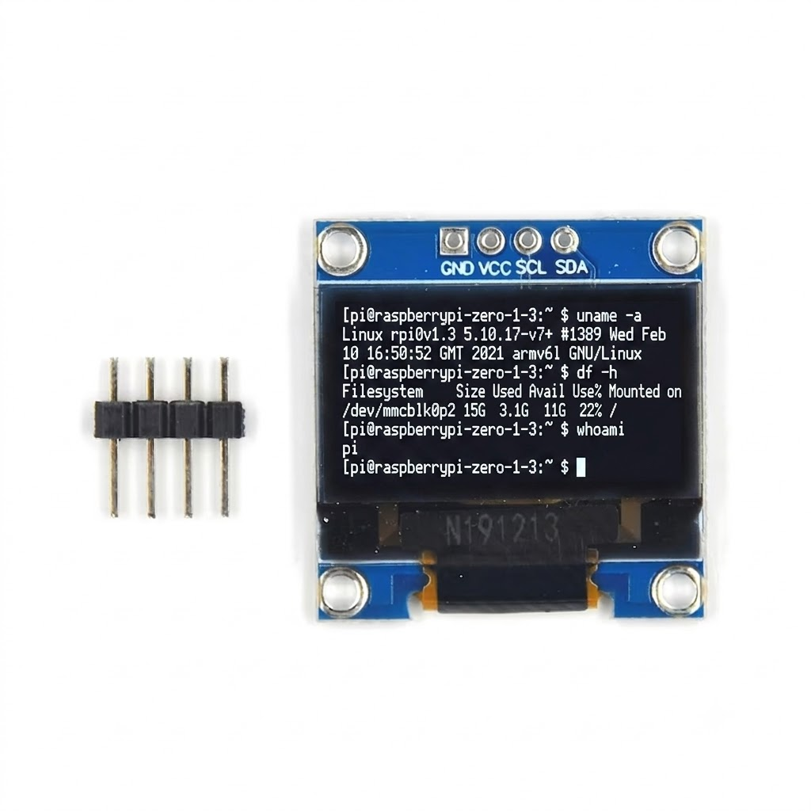
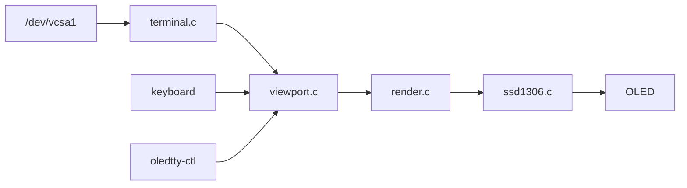

# oledtty

**Mirror your Raspberry Pi Linux console on a 128×64 I2C OLED — no HDMI required.**

[](LICENSE)
[](docs/HARDWARE.md)
[](CHANGELOG.md)
[](src/)

`oledtty` reads the active virtual console (`/dev/vcsa1`, tty1) and renders it live on an SSD1306 display. Written in **pure C** for the Raspberry Pi Zero — no Python, no Adafruit library, no third-party OLED dependencies.

<p align="center">
  
</p>

<p align="center">
  <em>Live terminal on Pi Zero 1.3 — boot messages, login, shell commands on a 4-pin I2C OLED.</em>
</p>

---

## Table of contents

- [Why this exists](#why-this-exists)
- [How it works](#how-it-works)
- [Gallery](#gallery)
- [Architecture](#architecture)
- [Display layout](#display-layout)
- [Features](#features)
- [Hardware](#hardware)
- [Deploy workflow](#deploy-workflow)
- [Quick start](#quick-start)
- [Installation](#installation)
- [Verify it works](#verify-it-works)
- [Daily usage](#daily-usage)
- [Performance](#performance)
- [Troubleshooting](#troubleshooting)
- [Documentation](#documentation)
- [License](#license)

---

## Why this exists

A Raspberry Pi Zero with a 0.96″ OLED is a perfect **headless computer** — except you cannot see boot messages, the login prompt, or shell output without HDMI. `oledtty` turns your soldered 4-pin I2C OLED into a **live micro-terminal**: kernel text, login screen, and commands appear in near real time.

---

## How it works

<p align="center">
  
</p>

```
Linux tty1  →  /dev/vcsa1  →  terminal  →  viewport  →  render  →  I2C  →  SSD1306
```

| Step | What happens |
|------|----------------|
| 1 | Kernel maintains tty1 text buffer in `/dev/vcsa1` |
| 2 | `terminal_read()` snapshots up to 30×80 chars around the cursor |
| 3 | `viewport_build()` selects 8×21 visible lines (+ scrollback pan) |
| 4 | `render_frame()` rasterizes 5×7 font into a 128×64 framebuffer |
| 5 | `ssd1306_flush_frame()` sends 1024 bytes over I2C every 80 ms |

**Deep dive:** [docs/ARCHITECTURE.md](docs/ARCHITECTURE.md)

---

## Gallery

### Hardware & wiring

| Terminal mirror | Pi Zero setup | I2C wiring |
|-----------------|---------------|------------|
|  |  |  |

### Diagrams & technical reference

| System architecture | Data pipeline | GPIO pinout |
|---------------------|---------------|-------------|
|  |  |  |

| Display grid | Viewport scrolling | Deploy workflow |
|--------------|-------------------|-----------------|
|  |  |  |

| vcsa memory format | Performance timing |
|--------------------|------------------|
|  |  |

---

## Architecture

<p align="center">
  
</p>



| Module | Role |
|--------|------|
| `terminal.c` | Row-by-row vcsa reader with cursor window |
| `viewport.c` | 8-line live follow + manual pan |
| `history.c` | 128-line scrollback buffer |
| `render.c` | White text + invert-block cursor |
| `font5x7.c` | Embedded bitmap font |
| `ssd1306.c` | I2C display driver |

Full diagrams, sequence charts, and code walkthrough: **[docs/ARCHITECTURE.md](docs/ARCHITECTURE.md)**

---

## Display layout

<p align="center">
  
</p>

| Spec | Value |
|------|-------|
| Panel | 128 × 64 pixels (SSD1306) |
| Visible text | **8 rows × 21 columns** |
| Font | 5×7 embedded bitmap |
| Cell size | 6 × 8 pixels |
| Cursor | Invert block, 500 ms blink |

How panning and scrollback work: **[docs/DISPLAY.md](docs/DISPLAY.md)**

---

## Features

| Feature | Description |
|---------|-------------|
| Real-time console mirror | Direct `/dev/vcsa1` read — no subprocesses |
| 8 × 21 viewport | Full screen of readable text on 128×64 |
| Virtual scrollback | Shift+Ctrl+Up/Down, Ctrl+Left/Right |
| SSH fallback | `oledtty-ctl up/down/left/right/live` |
| Large-console support | 30-row cursor window for Kali/wide tty (v2.0.3+) |
| Zero OLED deps | Raw Linux `i2c-dev` — no Adafruit, no Python |
| Boot service | systemd unit, auto-restart |
| Dry-run mode | `--dry-run` ASCII preview without hardware |

---

## Hardware

<p align="center">
  
</p>

| OLED pin | Pi pin | Signal |
|----------|--------|--------|
| VCC | Pin 1 | 3.3V |
| GND | Pin 6 | Ground |
| SCL | Pin 3 | GPIO 3 |
| SDA | Pin 5 | GPIO 2 |

Verify: `sudo i2cdetect -y 1` → expect **`3c`**

Full guide: **[docs/HARDWARE.md](docs/HARDWARE.md)**

---

## Deploy workflow

<p align="center">
  
</p>

| Step | Machine | Action |
|------|---------|--------|
| 1 | **PC** | Flash Pi OS Lite; copy `oledtty/` to USB pendrive |
| 2 | **Pi 3** | `sudo ./setup-for-pizero.sh` (build + install, no OLED needed) |
| 3 | **Pi Zero** | Move SD card → power on → OLED shows console |

**No WiFi required on the Pi Zero.**

---

## Quick start

### Clone from GitHub

```bash
git clone https://github.com/Monike123/oledtty.git
cd oledtty
make && sudo ./install.sh
```

### Pi Zero without WiFi (pendrive + Pi 3)

```bash
cp -r /media/$USER/USB/oledtty ~/
cd ~/oledtty
chmod +x setup-for-pizero.sh fix-line-endings.sh
sudo ./setup-for-pizero.sh
sudo shutdown -h now
# Move SD to Pi Zero → power on
```

---

## Installation

### Pi 3 → Pi Zero

```bash
cp -r /media/$USER/USB/oledtty ~/
cd ~/oledtty
chmod +x setup-for-pizero.sh fix-line-endings.sh
make clean && make
sudo ./setup-for-pizero.sh
sudo shutdown -h now
```

→ **[docs/DEPLOY.md](docs/DEPLOY.md)**

### Pi with internet

```bash
cd ~/oledtty
make clean && make
sudo ./install.sh
sudo systemctl disable --now oled.service 2>/dev/null || true
sudo systemctl restart oledtty
```

---

## Verify it works

```bash
systemctl status oledtty
journalctl -u oledtty -n 20 --no-pager
```

**Expected:** `oledtty 2.0.3` and **8 lines of white text** on the OLED.

```bash
# Test without OLED hardware
make && sudo ./build/oledtty --dry-run --once
```

---

## Daily usage

1. Power on Pi with OLED connected
2. Boot messages appear on the display
3. Log in at tty1 or use SSH (OLED mirrors **tty1**, not SSH)
4. Shell output mirrors in real time

| Keys | Action |
|------|--------|
| **Shift+Ctrl+Up** | Scroll to older output |
| **Shift+Ctrl+Down** | Return toward live view |
| **Ctrl+Left / Right** | Pan long lines |

---

## Performance

<p align="center">
  
</p>

| Metric | Value |
|--------|-------|
| Poll interval | 80 ms (~12.5 Hz) |
| I2C transfer | ~20–30 ms @ 400 kHz |
| Effective FPS | ~10–15 (I2C limited) |
| Memory | Static buffers, no heap in hot path |

---

## Troubleshooting

| Problem | Fix |
|---------|-----|
| Blank OLED | Check wiring; `sudo i2cdetect -y 1` → `3c` |
| White blocks, no text | Rebuild v2.0.3+ ([details](docs/TROUBLESHOOTING.md)) |
| `env: 'bash\r'` | Run `./fix-line-endings.sh` |
| Old `oled.service` | `sudo systemctl disable --now oled.service` |

→ **[docs/TROUBLESHOOTING.md](docs/TROUBLESHOOTING.md)**

---

## Documentation

| Document | Contents |
|----------|----------|
| [docs/ARCHITECTURE.md](docs/ARCHITECTURE.md) | **System design**, pipeline, vcsa format, timing |
| [docs/DISPLAY.md](docs/DISPLAY.md) | 8×21 grid, font, cursor, pan keys |
| [docs/HARDWARE.md](docs/HARDWARE.md) | Wiring, GPIO, I2C detect |
| [docs/DEPLOY.md](docs/DEPLOY.md) | Pi 3 → Pi Zero offline deploy |
| [docs/SETUP-GUIDE.md](docs/SETUP-GUIDE.md) | Full walkthrough |
| [docs/TROUBLESHOOTING.md](docs/TROUBLESHOOTING.md) | Common problems |
| [docs/images/](docs/images/) | All diagrams and photos |
| [CHANGELOG.md](CHANGELOG.md) | Version history |

---

## License

[MIT License](LICENSE) — Copyright (c) 2026 Manas

Free to use, modify, and distribute. No warranty.
