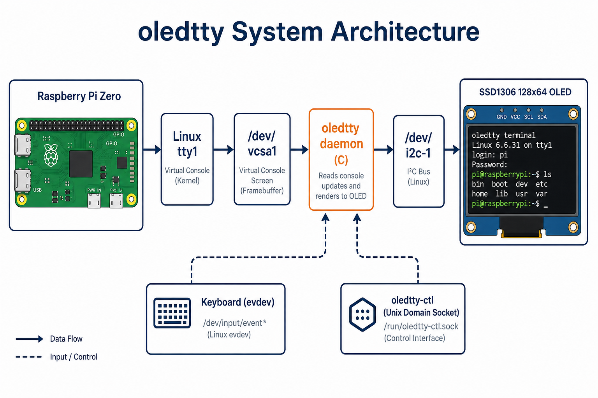
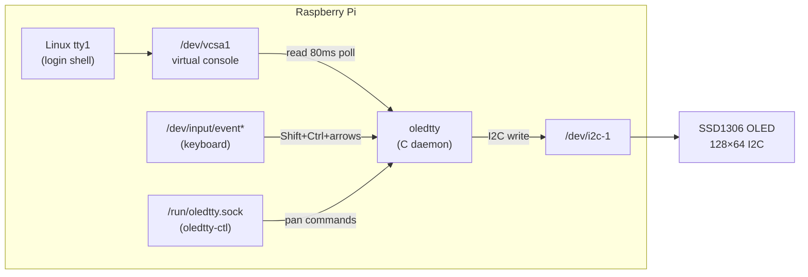
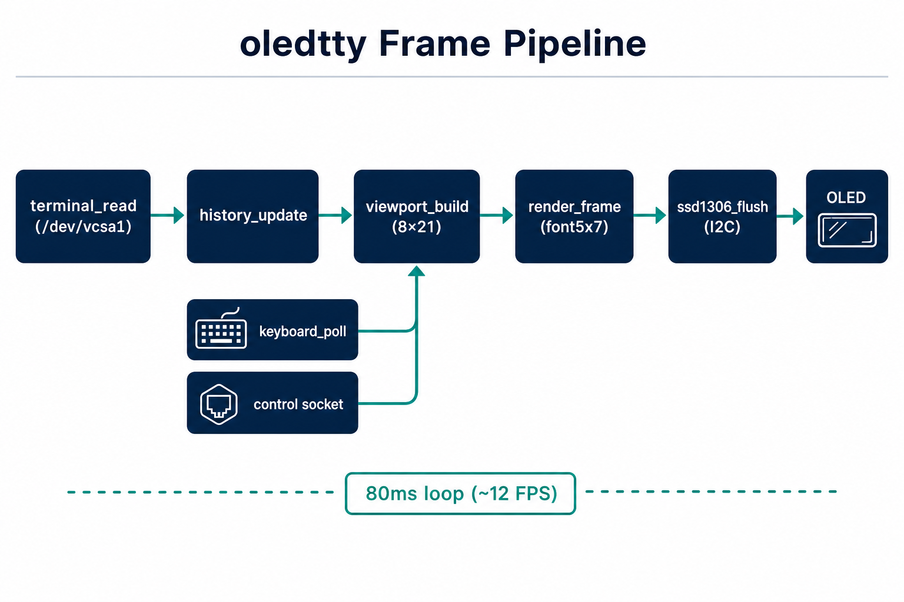
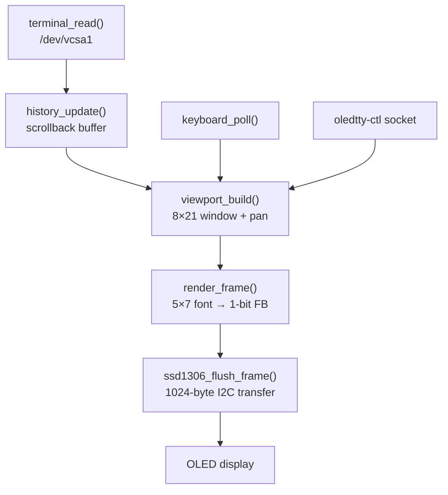
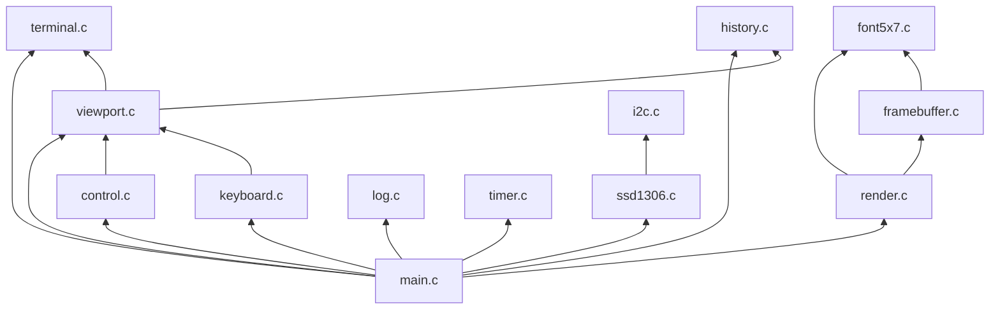
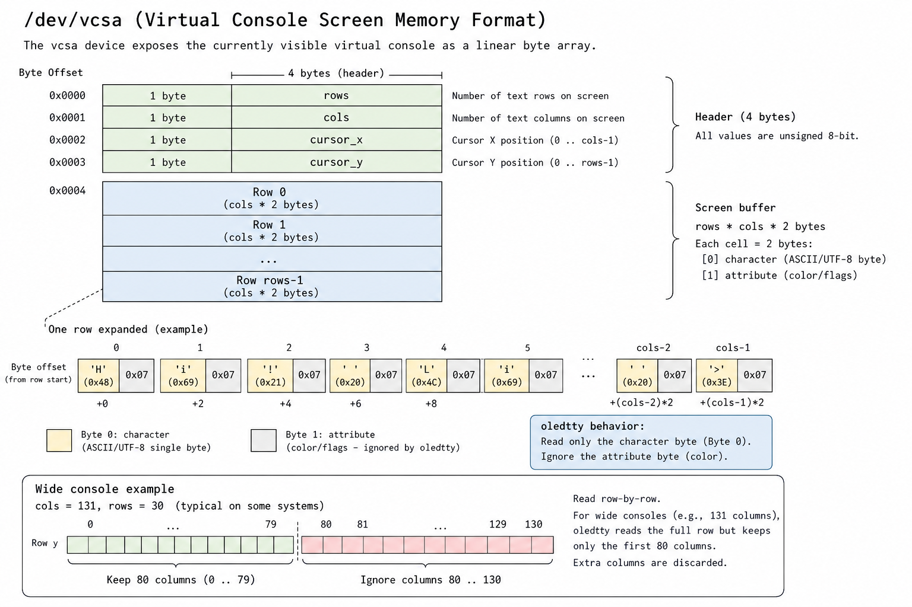
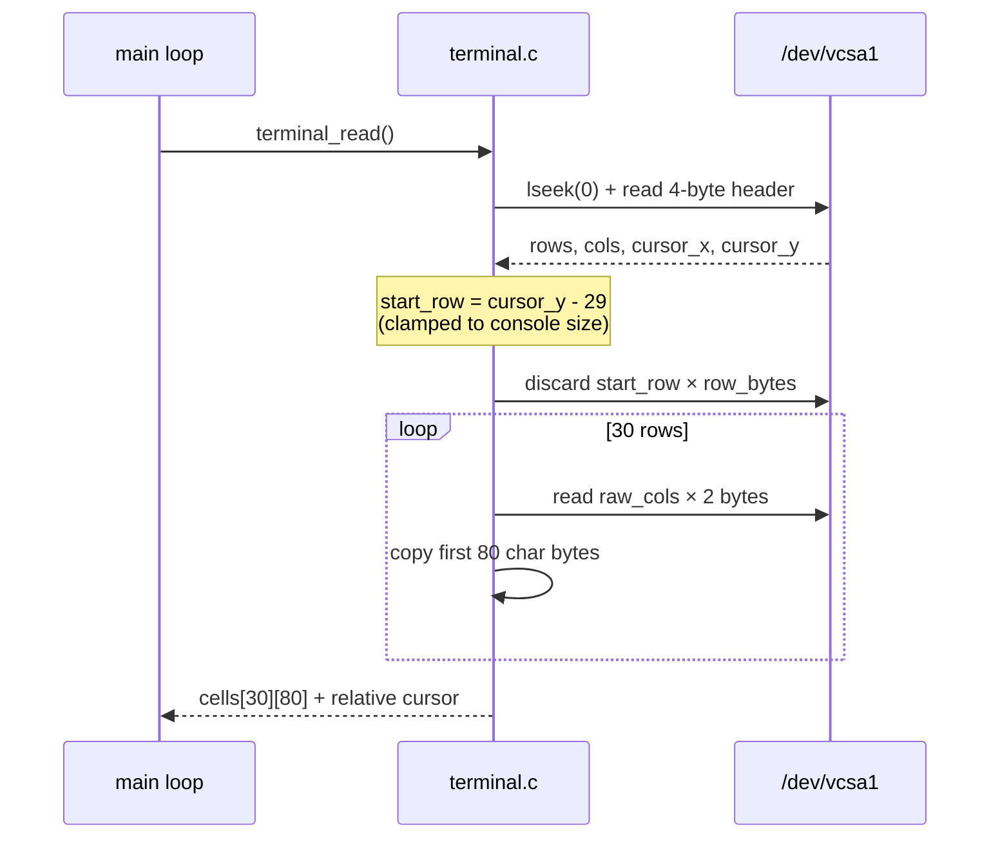
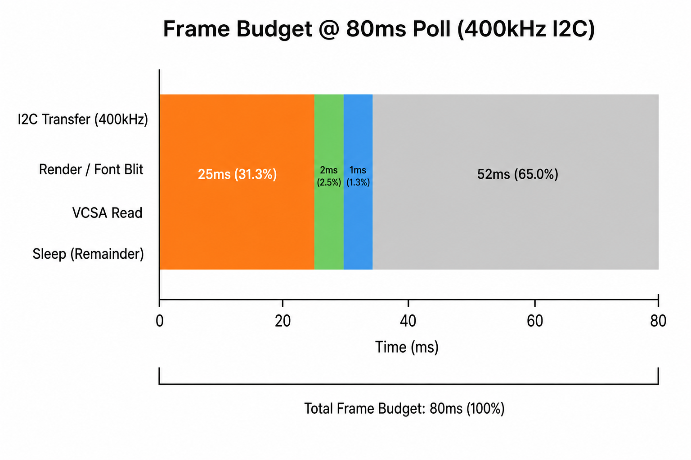
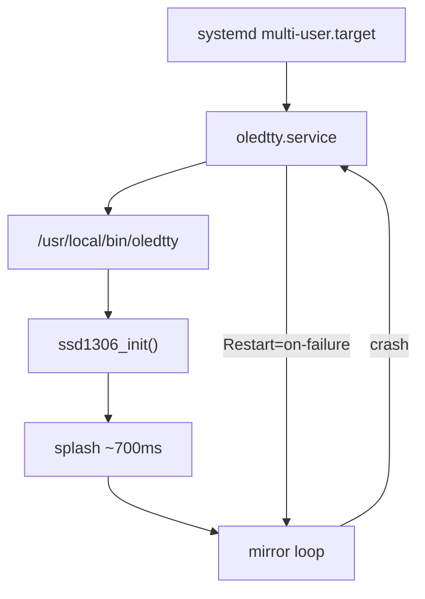
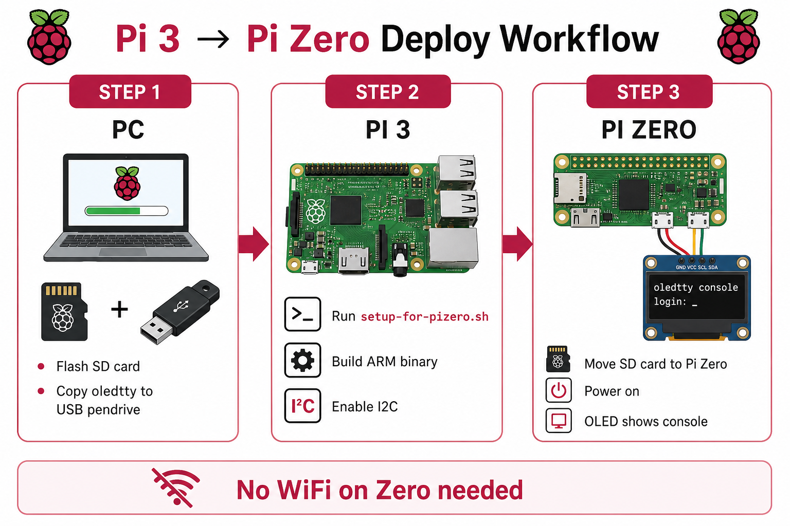

# Architecture

Deep dive into how `oledtty` mirrors the Linux console onto a 128×64 SSD1306 OLED.

---

## System overview

<p align="center">
  
</p>



### Why `/dev/vcsa1`?

| Device | Access | Contents |
|--------|--------|----------|
| `/dev/tty1` | Read/write | Interactive terminal (blocks if used wrong) |
| `/dev/vcs` | Read-only | Character grid only |
| `/dev/vcsa1` | Read-only | **Characters + attributes + cursor** (what we use) |

`oledtty` opens `/dev/vcsa1` read-only, seeks to 0 each frame, and parses the kernel’s snapshot of tty1. No subprocesses, no `script`, no framebuffer scraping.

---

## Software pipeline

<p align="center">
  
</p>

Each frame (~12 FPS at 80 ms poll):



| Stage | File | Input | Output |
|-------|------|-------|--------|
| Capture | `terminal.c` | vcsa bytes | 30×80 `cells[][]` + cursor |
| Scrollback | `history.c` | terminal rows | 128-line ring buffer |
| Viewport | `viewport.c` | cells + history + pan | 8×21 visible text |
| Rasterize | `render.c`, `font5x7.c` | viewport | 128×64 1-bit framebuffer |
| Blit | `framebuffer.c` | glyphs | pixel operations |
| Output | `ssd1306.c`, `i2c.c` | framebuffer | I2C transactions |

---

## Module dependency graph



### Source tree

```
oledtty/
├── src/main.c           Main loop, CLI, splash, signals
├── src/terminal.c       /dev/vcsa1 reader (row-by-row, cursor window)
├── src/viewport.c       8-line window, live follow, manual pan
├── src/history.c        Virtual scrollback for pan-up
├── src/render.c         Text rows + invert-block cursor
├── src/framebuffer.c    1-bit 128×64 buffer + font blit
├── src/font5x7.c        Embedded 5×7 glyph table (ASCII)
├── src/ssd1306.c        SSD1306 init, contrast, page flush
├── src/i2c.c            Linux i2c-dev ioctl wrapper
├── src/keyboard.c       evdev reader for pan hotkeys
├── src/control.c        Unix domain socket server
├── src/oledtty_ctl.c    SSH-side pan CLI client
├── src/log.c            stderr logging
└── src/timer.c          monotonic ms sleep
```

---

## vcsa memory layout

<p align="center">
  
</p>

```
Offset 0:   [rows][cols][cursor_x][cursor_y]   ← 4-byte header
Offset 4:   Row 0: (char, attr) × cols
            Row 1: (char, attr) × cols
            ...
```

- **char** — ASCII character byte (what oledtty displays)
- **attr** — Linux console color attribute (ignored — OLED is monochrome)
- **Wide consoles** — if `cols > 80`, each row is `cols × 2` bytes; oledtty reads row-by-row and keeps the first 80 characters

### Cursor window (v2.0.3+)

On large consoles (e.g. Kali 86×131), the cursor may be on row 85. Reading only rows 0–29 would show blank text. `terminal_read()` computes a **30-row sliding window** that always includes the cursor row:



---

## Main loop

The hot path runs every `OLEDTTY_POLL_INTERVAL_MS` (default 80 ms):

```c
while (running) {
    apply_pan_cmd(&view, control_server_poll(&ctrl_srv), &hist);
    apply_pan_cmd(&view, keyboard_poll(&keyboard), &hist);

    if (terminal_read(&term) == 0)
        history_update(&hist, &term);

    viewport_build(&term, &hist, &view, &vp);
    render_frame(&fb, &vp, cursor_blink_on);
    ssd1306_flush_frame(&display, fb.data, sizeof(fb.data));

    timer_sleep_ms(poll_ms, &running);
}
```

### Design constraints

| Rule | Reason |
|------|--------|
| No `malloc` in hot path | Predictable memory on Pi Zero |
| No subprocesses | Low latency, no shell overhead |
| Full framebuffer flush | Simple, reliable — no partial-update bugs |
| `nice(10)` | Yields CPU to the shell |
| Root for vcsa | `/dev/vcsa1` requires elevated access |

---

## Performance

<p align="center">
  
</p>

| Metric | Typical value | Notes |
|--------|---------------|-------|
| Poll rate | 12.5 Hz (80 ms) | `--poll-ms` to change |
| Frame size | 1024 bytes | Full 128×64 1-bit buffer |
| I2C @ 400 kHz | ~20–30 ms | Dominant cost per frame |
| vcsa read | ~1 ms | Row-by-row, up to 30 rows |
| Render | ~1–2 ms | 8×21 glyph blits |
| CPU usage | Low | Static buffers, no Python |
| RAM | ~50 KB static | No heap churn in loop |

**Effective refresh: ~10–15 FPS** — limited by I2C bandwidth, not CPU. Ideal for a text console; not suitable for animation or video.

### Tuning I2C speed

```ini
# /boot/firmware/config.txt
dtparam=i2c_arm=on
dtparam=i2c_arm_baudrate=400000
```

Try `100000` if the display glitches (undervoltage or long wires).

---

## Boot integration



| Unit setting | Value |
|--------------|-------|
| `ExecStart` | `/usr/local/bin/oledtty` |
| `User` | `root` (vcsa access) |
| `After` | `multi-user.target` |
| `Restart` | `on-failure` |

Signal `SIGUSR1` forces a full redraw without restart.

---

## Deploy workflow (offline Pi Zero)

<p align="center">
  
</p>

See [DEPLOY.md](DEPLOY.md) for step-by-step commands.

---

## Related docs

| Doc | Topic |
|-----|-------|
| [DISPLAY.md](DISPLAY.md) | 8×21 grid, font, cursor, pan keys |
| [HARDWARE.md](HARDWARE.md) | Wiring, GPIO, I2C detect |
| [DEPLOY.md](DEPLOY.md) | Pi 3 → Pi Zero offline install |
| [TROUBLESHOOTING.md](TROUBLESHOOTING.md) | Blank screen, CRLF, competing services |

[← Back to README](../README.md)
