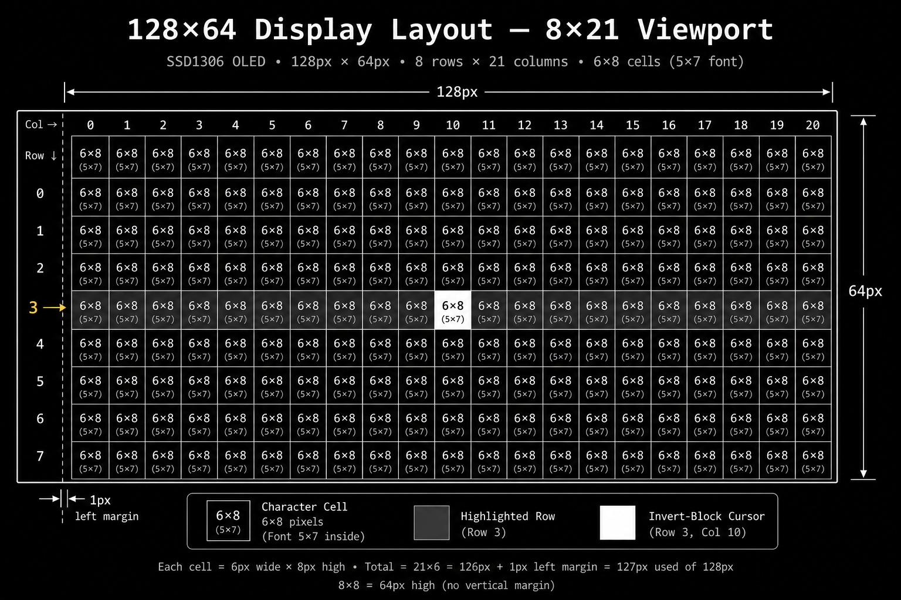
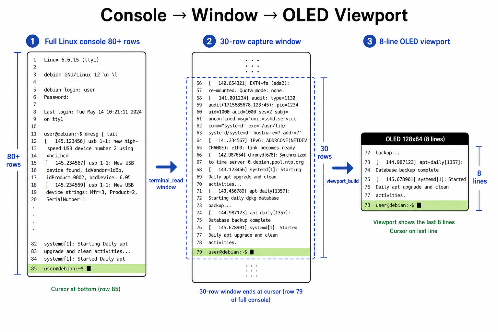
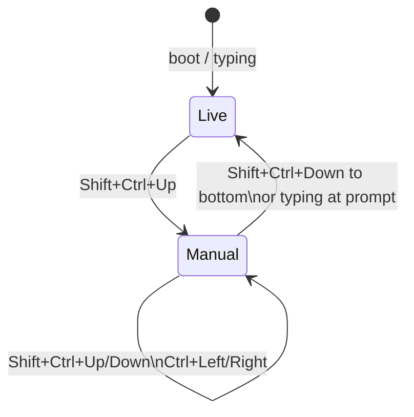
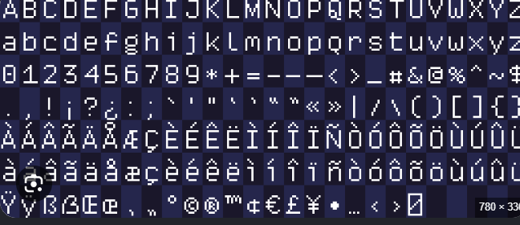

# Display Layout and Viewport

How text is mapped from the Linux console onto the 128×64 OLED.

---

## Screen layout (v2.0.3)

**8 lines × 21 characters** on a **128×64** panel, using an embedded **5×7** bitmap font in **6×8** pixel cells. Text is white on black; the cursor is an **invert block** (white rectangle behind the glyph).

<p align="center">
  
</p>

### Pixel math

| Parameter | Value | Calculation |
|-----------|-------|-------------|
| Panel size | 128 × 64 px | SSD1306 native resolution |
| Left margin | 1 px | `OLEDTTY_TEXT_MARGIN_X` |
| Cell size | 6 × 8 px | 5 px glyph + 1 px column gap |
| Visible grid | 21 × 8 chars | `(128−1) / 6 = 21`, `64 / 8 = 8` |
| Framebuffer | 1024 bytes | 128 × 64 ÷ 8 bits (page-organized) |

### ASCII layout

```
 0         1         2         ...        20
┌─┬─┬─┬─┬─┬─┬─┬─┬─┬─┬─┬─┬─┬─┬─┬─┬─┬─┬─┬─┬─┐  row 0  (y 0–7)
│p│i│@│r│a│s│p│b│e│r│r│y│p│i│-│z│e│r│o│:│~│$│  row 1
└─┴─┴─┴─┴─┴─┴─┴─┴─┴─┴─┴─┴─┴─┴─┴─┴─┴─┴─┴─┴─┘
 ...
┌─┬─┬─┬─┬─┬─┬─┬─┬─┬─┬─┬─┬─┬─┬─┬─┬─┬─┬─┬─┬─┐  row 7  (y 56–63)
│ │ │ │ │ │ │ │ │ │ │█│ │ │ │ │ │ │ │ │ │ │  ← invert cursor
└─┴─┴─┴─┴─┴─┴─┴─┴─┴─┴─┴─┴─┴─┴─┴─┴─┴─┴─┴─┴─┘
  ↑ each cell = 6×8 px, glyph drawn in top 5×7
```

---

## Three layers of “window”

The full Linux console can be **much larger** than the OLED. oledtty uses three nested windows:

<p align="center">
  
</p>

| Layer | Size | Module | Purpose |
|-------|------|--------|---------|
| **Linux console** | e.g. 86×131 (Kali) | kernel | Full tty buffer |
| **Capture buffer** | up to 30×80 | `terminal.c` | Sliding window around cursor |
| **OLED viewport** | 8×21 | `viewport.c` | What you actually see |
| **Scrollback** | 128 lines | `history.c` | Pan up into past output |

### Live follow mode

In live mode (`VIEW_MODE_LIVE`), the 8-line viewport is anchored so the **cursor sits on the bottom visible row** (row 7). New shell output scrolls naturally upward on the OLED.

### Manual pan mode

**Shift+Ctrl+Up/Down** moves `pan_row` into the history buffer. **Ctrl+Left/Right** shifts `pan_col` for long lines wider than 21 characters.



---

## Font and charset

Embedded **5×7** bitmap font (`src/font5x7.c`). Printable ASCII (0x20–0x7E) plus common symbols. Control characters and DEL render as spaces.

<p align="center">
  
</p>

Non-printable vcsa bytes are sanitized in `terminal.c` before rendering — **color attribute bytes are ignored**; the OLED is monochrome.

---

## Cursor rendering

1. `render_frame()` draws all 8 text rows in white
2. If cursor is visible in the viewport and blink phase is ON:
   - `fb_invert_rect()` XOR-inverts the 6×8 cell under the cursor
3. Blink toggles every **500 ms** (`OLEDTTY_CURSOR_BLINK_MS`)

---

## Horizontal pan (long lines)

When a line exceeds 21 characters, live mode auto-pans so the cursor stays visible:

```
Full line (80 cols):  pi@raspberrypi-zero:~/oledtty$ make clean
OLED (21 cols):                    y$ make clean
                                   ↑ col_start follows cursor
```

---

## Keyboard navigation (tty1)

| Keys | Action |
|------|--------|
| **Shift+Ctrl+Up** | Scroll to older lines |
| **Shift+Ctrl+Down** | Scroll toward live view |
| **Ctrl+Left / Right** | Pan long lines horizontally |
| Plain **Arrow** keys | Shell only (not captured) |
| Typing | Returns to live follow |

## SSH fallback

```bash
oledtty-ctl up      # scroll up
oledtty-ctl down    # scroll down
oledtty-ctl left    # pan left
oledtty-ctl right   # pan right
oledtty-ctl live    # return to live follow
```

---

## Related docs

- [ARCHITECTURE.md](ARCHITECTURE.md) — full pipeline and timing
- [HARDWARE.md](HARDWARE.md) — wiring and I2C
- [README](../README.md)
