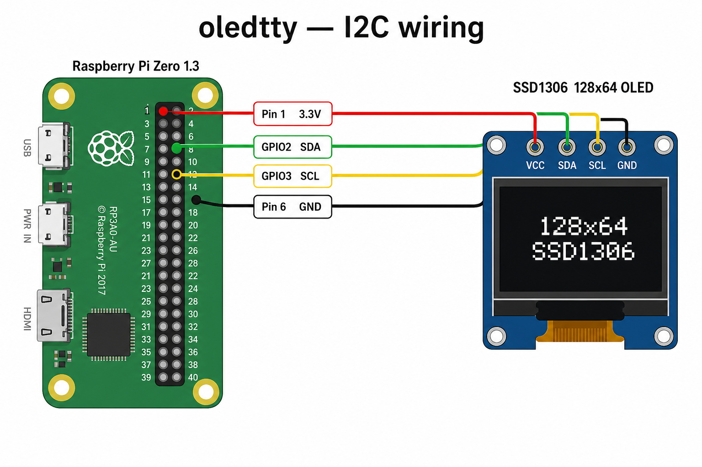
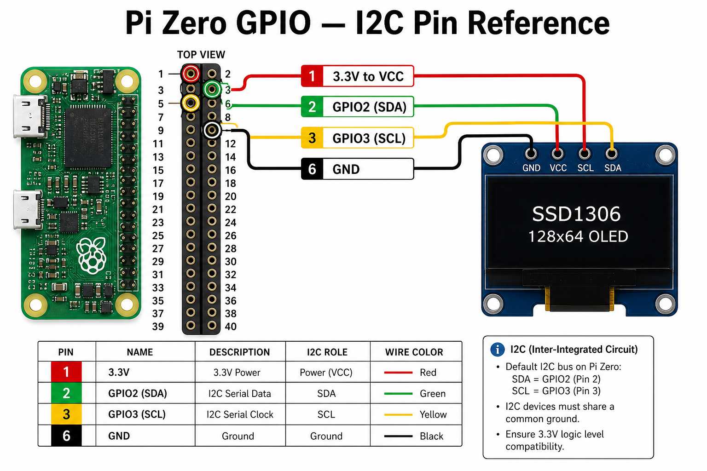
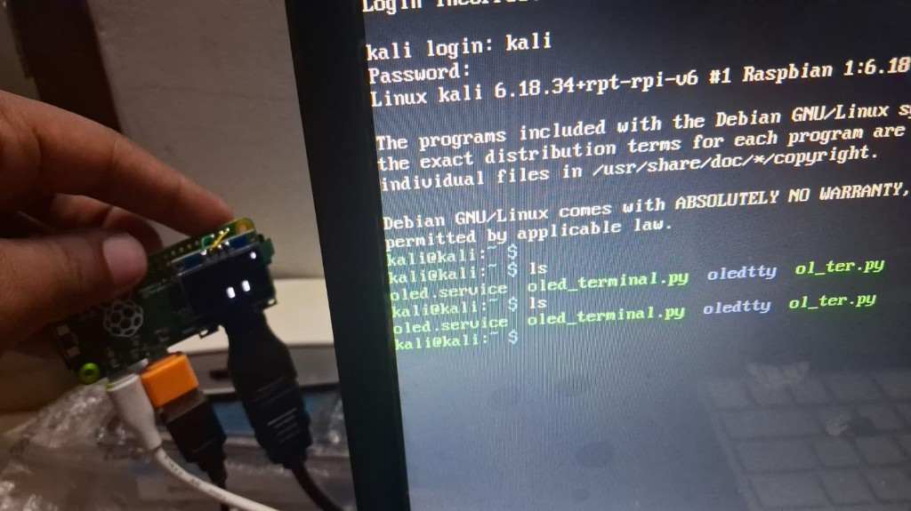
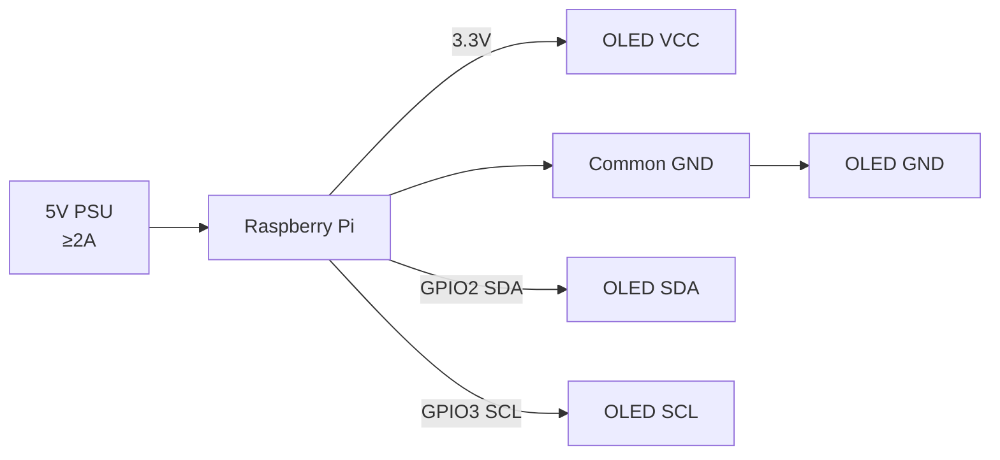

# Hardware Guide

Wiring, GPIO reference, and I2C setup for `oledtty` on Raspberry Pi.

---

## Bill of materials

| Item | Specification |
|------|---------------|
| Raspberry Pi | Zero 1.3, Zero W, 3, 4, or 5 |
| Display | 128×64 SSD1306 OLED, **4-pin I2C** breakout |
| I2C address | `0x3C` (some modules use `0x3D`) |
| Power | 3.3V logic — use Pi 3.3V pin, not 5V |
| Cables | Short dupont or soldered header |

---

## Wiring overview

<p align="center">
  
</p>

| OLED pin | Pi connection | GPIO header |
|----------|---------------|-------------|
| **VCC** | 3.3V | Pin 1 |
| **GND** | Ground | Pin 6 |
| **SCL** | I2C clock | Pin 3 (GPIO 3) |
| **SDA** | I2C data | Pin 5 (GPIO 2) |

---

## GPIO pin reference

<p align="center">
  
</p>

```
     3.3V  (1) (2)  5V
    SDA/GPIO2 (3) (4)  5V
    SCL/GPIO3 (5) (6)  GND   ← OLED GND here
              ...
```

> **Note:** Pin numbers follow the standard 40-pin Pi header. Pi Zero uses the same pinout on its smaller header.

---

## Physical setup photo

<p align="center">
  
</p>

Tips for a reliable build:

- Solder the header for a permanent install (dupont jumpers work for prototyping)
- Keep wires **short** — I2C is sensitive to capacitance and noise
- Use a **stable 5V PSU** (≥2A recommended) — undervoltage causes I2C glitches
- Mount the OLED away from switching regulators if possible

---

## Enable I2C

### Raspberry Pi OS

```bash
sudo raspi-config
# Interface Options → I2C → Enable
```

Or add to `/boot/firmware/config.txt`:

```ini
dtparam=i2c_arm=on
dtparam=i2c_arm_baudrate=400000
```

Reboot, then verify:

```bash
ls /dev/i2c-*
# expect /dev/i2c-1

sudo i2cdetect -y 1
```

Expected scan result — OLED at address `3c`:

```
     0  1  2  3  4  5  6  7  8  9  a  b  c  d  e  f
00:                         -- -- -- -- -- -- -- --
10: -- -- -- -- -- -- -- -- -- -- -- -- -- -- -- --
20: -- -- -- -- -- -- -- -- -- -- -- -- -- -- -- --
30: -- -- -- -- -- -- -- -- -- -- -- -- 3c -- -- --
40: -- -- -- -- -- -- -- -- -- -- -- -- -- -- -- --
```

If nothing appears at `3c`:

1. Check wiring (SDA/SCL not swapped)
2. Confirm 3.3V on VCC
3. Try address `0x3D` with `--address 0x3D`
4. Lower I2C speed to 100 kHz

---

## Voltage and logic levels

| Signal | Level |
|--------|-------|
| Pi GPIO | 3.3V |
| SSD1306 I2C | 3.3V tolerant on most breakouts |
| VCC | **3.3V from Pi** (safer than 5V modules) |

Some OLED boards accept 5V on VCC but still use 3.3V I2C — read your module’s silkscreen.

---

## I2C bus speed tuning

| Baud rate | When to use |
|-----------|-------------|
| 100000 (100 kHz) | Long wires, glitchy display, undervoltage |
| 400000 (400 kHz) | **Default recommendation** |
| 1000000 (1 MHz) | Short wires, stable power — not guaranteed |

```ini
# /boot/firmware/config.txt
dtparam=i2c_arm_baudrate=400000
```

After changing, reboot and restart oledtty:

```bash
sudo systemctl restart oledtty
```

---

## Electrical block diagram



Pull-up resistors (typically 4.7kΩ) are usually **on the OLED module** already.

---

## Compatible boards

| Board | Notes |
|-------|-------|
| Pi Zero 1.3 | Primary target, ARMv6 build in `setup-for-pizero.sh` |
| Pi Zero W / 2W | Works — same GPIO |
| Pi 3 / 4 / 5 | Works — use `install.sh` directly |
| Kali on Pi | Tested — needs v2.0.3+ for large console grids |

---

## Related docs

- [ARCHITECTURE.md](ARCHITECTURE.md) — software pipeline
- [DISPLAY.md](DISPLAY.md) — pixel layout
- [DEPLOY.md](DEPLOY.md) — install on Pi Zero
- [TROUBLESHOOTING.md](TROUBLESHOOTING.md) — blank screen, power issues

[← Back to README](../README.md)
